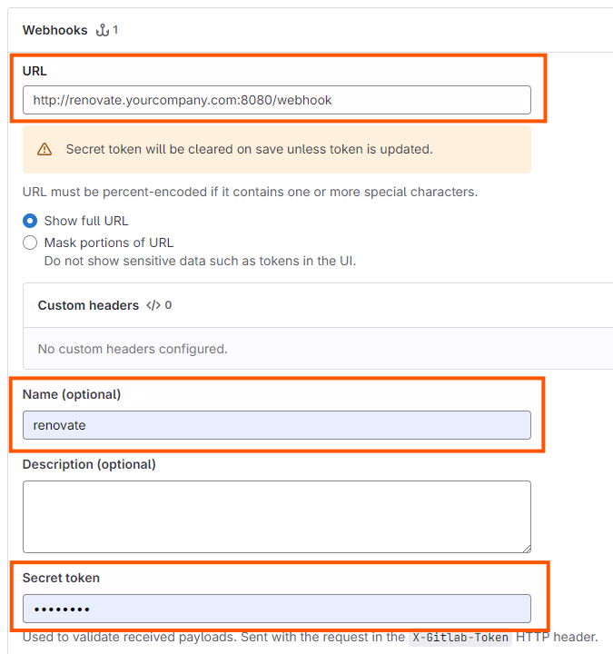
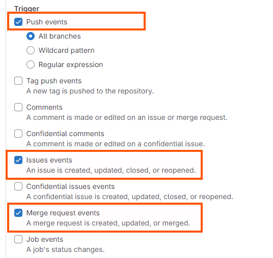

# Set up Mend Renovate Self-hosted App for GitLab

## Configure Renovate Bot Account on GitLab

Two main parts to Bot setup:

1. **Create the Renovate Bot user account** on GitLab - and get the **PAT**

Personal Access Token (PAT) for the user account will used by your Renovate server for interacting with your repos on GitLab.

2. **Create Webhooks** to respond to activity on the repo.

Without webhooks, Renovate jobs will run only on the configured schedule, or by API call.
Jobs triggered by webhooks jump the queue, and are scheduled to run as soon as possible.  

### Step 1a: Renovate Bot user Account

In GitLab, the "Renovate Bot" is not an App or Plugin; it's a GitLab user account that's been given the right permissions on the repository.

Create a GitLab user account to act as the "Renovate Bot".

> [!NOTE] 
> 
> You should use a dedicated "bot account" for Renovate, instead of using someone's personal user account.
> 
> Apart from reducing the chance of conflicts, it is better for teams if the actions they see from Renovate are clearly marked as coming from a dedicated bot account and not from a teammate's account, which could be confusing at times.
> e.g. Did the bot automerge that PR, or did a human do it?

#### Self-hosted GitLab:
- If you are running your own instance of GitLab, it's suggested to name the account "Renovate Bot" with username "renovate-bot".

#### GitLab Cloud:
- If your repos are on GitLab.com, create a new user account on GitLab cloud.
You will need a globally unique name for the bot, for instance "yourcompany-renovate".

### Step 1b: Generate a Personal Access Token (PAT)

Once the account is created, [create a Personal Access Token](https://docs.gitlab.com/ee/user/profile/personal_access_tokens.html) for the new Renovate user account. 

Assign the following permissions:
  * `api`
  * `read_user`
  * `write_repository`

Keep the PAT handy for the Configuration of the Renovate Self-Hosted App to set `MEND_RNV_GITLAB_PAT`.

### Step 2: Add Webhooks

Webhooks allow GitLab to ping your Renovate server whenever an activity occurs on the designated repositories or groups.
Activities like a new commit, a merged PR, a change to a package file, etc will trigger Renovate to run a new job on that repo.
Renovate can also respond to checkbox activities in PRs and the Dependency Dashboard.

> [!NOTE]
> 
> You can still run Renovate without webhooks.
> - Renovate Jobs will run on a schedule, which is highly configurable.
> - The Admin APIs can be used to trigger App Sync and to run a Renovate job on a single repo.

You can enable webhooks on your GitLab repos manually, or with automation.

#### Option: Automatic webhook creation

When enabled, will automatically install webhooks for all repos that are enabled with Renovate. Attempts are made to remove webhooks when repos are uninstalled.

Webhook installation requires an admin user account that has `Maintainer` access to the repos.

> [!NOTE]
>
> This admin account used for webhooks can be the repo owner account, or it can be another account that has more limited access to the repos.
>
> The Renovate user account can be used, but it would require an upgrade in minimum permissions (from `Developer` to `Maintainer`) on the repos it manages webhooks on.

To enable automatic webhook creation:

Set `MEND_RNV_WEBHOOK_URL`:
- When set, webhooks will be installed on repos when Renovate is enabled.
- Set the webhook URL to point to the Renovate server url followed by `/webhook`. (e.g. `http://renovate.yourcompany.com:8080/webhook` or `https://1.2.3.4/webhook`)  

Set `MEND_RNV_ADMIN_TOKEN`: [Optional]
- Could be repo owner account, or special high-privilege account.
- Defaults to the primary Renovate user PAT when not provided. 
- Important: Webhooks will be only installed on repos that the account has at least `Maintainer` access to.

#### Option: Manually add webhooks

Add a **Group webhook** to each GitLab Group that you want webhooks triggered on.
- This is an easy way to cover webhooks for all repos in the group.
- Webhooks coming from Repositories that haven't enabled Renovate will be ignored.

You can add **Repo webhooks** to each individual repo that you want webhooks enabled for.
- This might be suitable if you are only installing Renovate on a small number of repos or don't have access to Group webhooks.
- A good option if you want fine-grained control over which repos trigger webhooks to your Renovate server.

> [!WARNING]
> 
> Avoid using **Server hooks** because there they will not trigger `Issues events`, such as using checkboxes in the Dependency Dashboard issue.

**Set webhook properties as shown below:**

##### URL
- Set the webhook URL to point to the Renovate server url followed by `/webhook`. (e.g. `http://renovate.yourcompany.com:8080/webhook` or `https://1.2.3.4/webhook`)

##### Name (Optional)
- You can set a name for the webhook: ie. "renovate"

> [!TIP]
> 
> Renovate's webhook listener binds to port 8080 inside its container, but you can map it (using Docker) to whatever external port you require, including port 80.

##### Secret token
- Set the webhook secret to the same value configured for `MEND_RNV_WEBHOOK_SECRET` (defaults to `renovate`)

##### Trigger
- Set event triggers for:
   * `Push events` (All branches)
   * `Issues events`
   * `Merge request events`

##### SSL Verification

- Diasble SSL verification unless required by your server

## Run Mend Renovate Self-hosted App

You can run Mend Renovate Self-hosted App from a Docker command line prompt, or by using a Docker Compose file. Examples are provided in the links below.

**Example Docker Compose files:**

- [Mend Renovate Community Edition](../examples/docker-compose/renovate-ce-github.yml)
- [Mend Renovate Enterprise Edition](../examples/docker-compose/renovate-ee-simple.yml)

> [!NOTE]
>
> Some configuration of environment variables will be required inside the Docker Compose files.
>
> Essential configuration options are shown below. For a full list of configurable variables, see [Configuration Options](configuration-options.md).

## Configure Environment Variables

### Essential Configuration for Mend Renovate Sever

**`MEND_RNV_ACCEPT_TOS`**: Set this environment variable to `y` to consent to [Mend's Terms of Service](https://www.mend.io/terms-of-service/).

**`MEND_RNV_LICENSE_KEY`**: Provide a valid license key for Renovate Community Edition or Enterprise Edition

> [!Note]
>
> To run Renovate Community Edition with **up to 10 repositories**, you can use this unregistered license key:
>
> `eyJsaW1pdCI6IjEwIn0=.30440220457941b71ea8eb345c729031718b692169f0ce2cf020095fd328812f4d7d5bc1022022648d1a29e71d486f89f27bdc8754dfd6df0ddda64a23155000a61a105da2a1`
>
> For a free license key for an **unrestricted number of repositories** on Renovate Community Edition, register with the form on the [Renovate Community Edition web page](https://www.mend.io/mend-renovate-community/).
>
> For an Enterprise license key, contact Mend at http://mend.io.

**`MEND_RNV_PLATFORM`**: Set this to `gitlab`.

**`MEND_RNV_ENDPOINT`**: This is the API endpoint for your GitLab host. e.g. like `https://gitlab.company.com/api/v4/`. Include the trailing slash.

**`MEND_RNV_SERVER_PORT`**: The port on which the server listens for webhooks and api requests. Defaults to 8080.

**`MEND_RNV_GITLAB_PAT`**: Personal Access Token (PAT) for the GitLab bot account.

**`MEND_RNV_ADMIN_API_ENABLED`**: Set to 'true' to enable Admin APIs. Defaults to 'false'.

**`MEND_RNV_SERVER_API_SECRET`**: Required if Admin APIs are enabled, or if running Enterprise Edition.

**`MEND_RNV_WEBHOOK_SECRET`**: Must match the secret sent by the GitLab webhooks. Defaults to 'renovate'.

**`MEND_RNV_WEBHOOK_URL`**: [Optional] Set to the URL of your webhook handler to enable automatic webhook creation. (eg. `http://renovate.yourcompany.com:8080/webhook`)

**`MEND_RNV_ADMIN_TOKEN`**: [Optional] Used when automatically adding webhooks. Provide a PAT for a user with `Maintainer` access to repos.

**`GITHUB_COM_TOKEN`**: A Personal Access Token for a user account on github.com

**Additional Configuration options**

For further details and a list of all available options, see the [Configuration Options](configuration-options.md) page.

### Renovate CLI Configuration

Renovate CLI functionality can be configured using environment variables (e.g. `RENOVATE_XXXXXX`) or via a `config.js` file mounted to `/usr/src/app/config.js` inside the Mend Renovate container.

**npm Registry**

If using your own npm registry, you may find it easiest to update your Docker Compose file to include a volume that maps an `.npmrc` file to `/home/ubuntu/.npmrc`. The RC file should contain `registry=...` with the registry URL your company uses internally. This will allow Renovate to find shared configs and other internally published packages.
